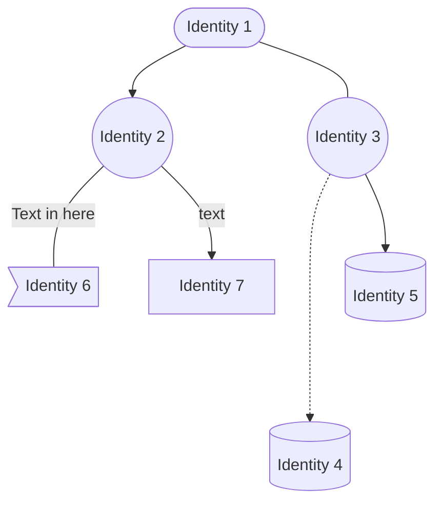

```mermaid
flowchart TB
    id1(["Identity 1"])  
    id2(("Identity 2"))
    id3(("Identity 3"))
    id4[("Identity 4")]
    id5[("Identity 5")]
    id6>"Identity 6"]
    id7["Identity 7"]

    id1 --> id2
    id1 --- id3
    id3 -...-> id4
    id3 --> id5
    id2 --Text in here--- id6
    id2 -->|text| id7

  

```