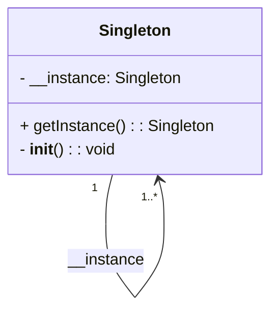

```mermaid
classDiagram
    class Singleton {
        - __instance: Singleton
        + getInstance(): Singleton
        - __init__(): void
    }

    Singleton "1" --> "1..*" Singleton: __instance

```