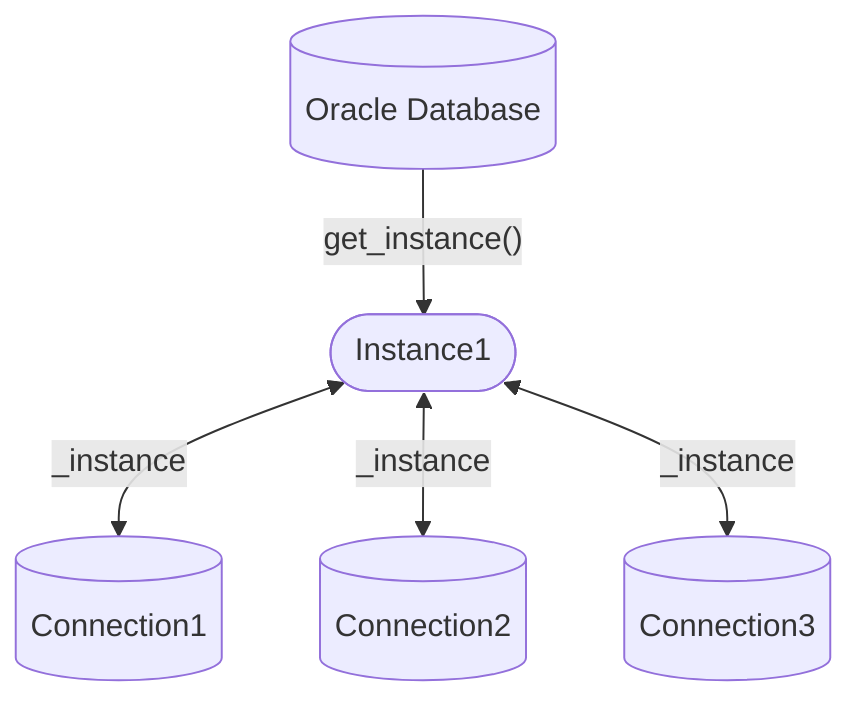

```mermaid 
flowchart TB

 Database[("Oracle Database")]
    Singleton(["Instance1"])

    Connection1[("Connection1")]
    Connection2[("Connection2")]
    Connection3[("Connection3")]

    Database -->|"get_instance()"| Singleton
    Singleton <-->|_instance| Connection1
    Singleton <-->|_instance| Connection2
    Singleton <-->|_instance| Connection3
 

```