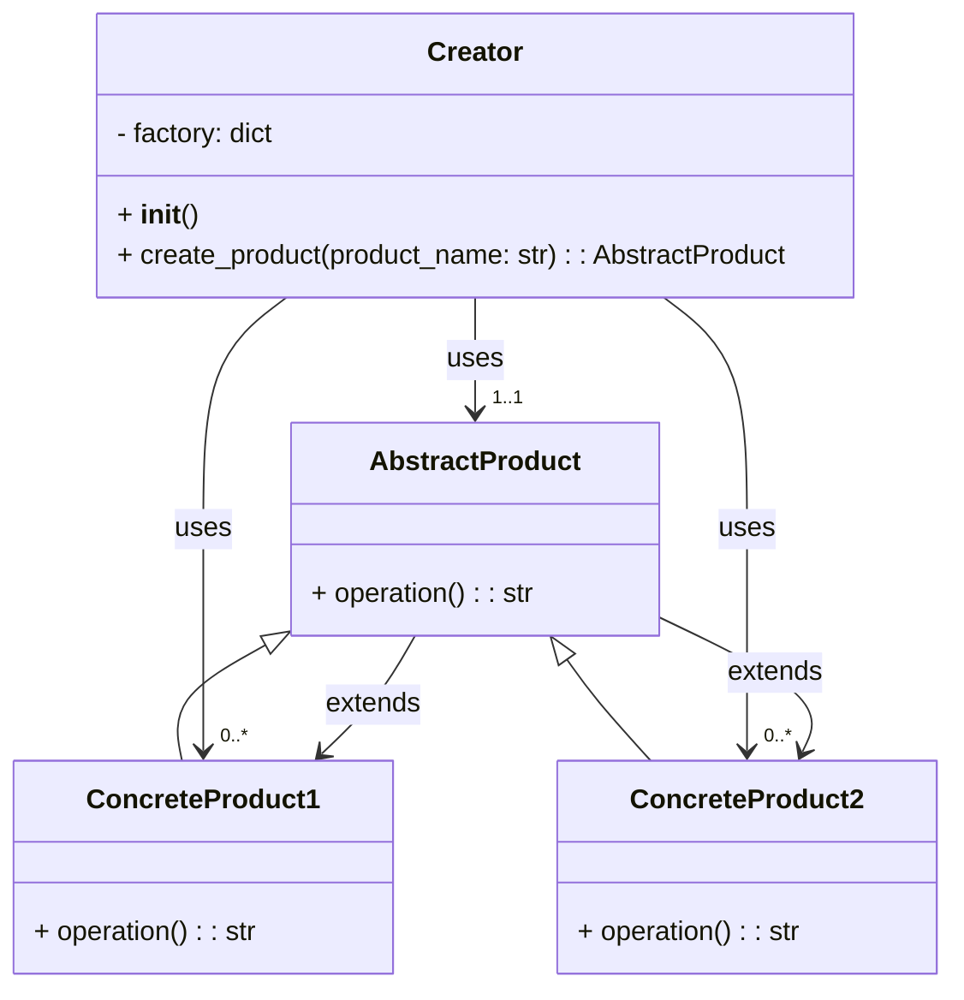

```mermaid
classDiagram
    class AbstractProduct {
        + operation(): str
    }

    AbstractProduct <|-- ConcreteProduct1
    AbstractProduct <|-- ConcreteProduct2

    class ConcreteProduct1 {
        + operation(): str
    }

    class ConcreteProduct2 {
        + operation(): str
    }

    class Creator {
        - factory: dict
        + __init__()
        + create_product(product_name: str): AbstractProduct
    }

    Creator --> "1..1" AbstractProduct: uses
    Creator --> "0..*" ConcreteProduct1: uses
    Creator --> "0..*" ConcreteProduct2: uses

    AbstractProduct --> ConcreteProduct1: extends
    AbstractProduct --> ConcreteProduct2: extends


```