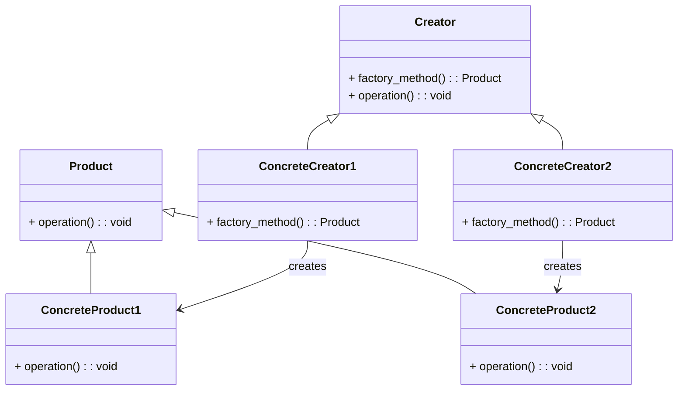

```mermaid
classDiagram
    class Creator {
        + factory_method(): Product
        + operation(): void
    }

    class Product {
        + operation(): void
    }

    class ConcreteCreator1 {
        + factory_method(): Product
    }

    class ConcreteCreator2 {
        + factory_method(): Product
    }

    class ConcreteProduct1 {
        + operation(): void
    }

    class ConcreteProduct2 {
        + operation(): void
    }

    Creator <|-- ConcreteCreator1
    Creator <|-- ConcreteCreator2
    Product <|-- ConcreteProduct1
    Product <|-- ConcreteProduct2
    ConcreteCreator1 --> ConcreteProduct1: creates
    ConcreteCreator2 --> ConcreteProduct2: creates


```