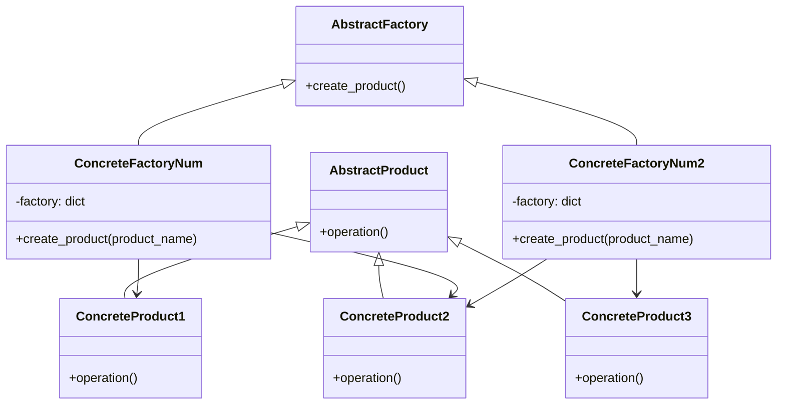

```mermaid
classDiagram
    class AbstractProduct {
        +operation()
    }

    class ConcreteProduct1 {
        +operation()
    }

    class ConcreteProduct2 {
        +operation()
    }

    class ConcreteProduct3 {
        +operation()
    }

    
    class AbstractFactory {
        +create_product()
    }

    class ConcreteFactoryNum {
        -factory: dict
        +create_product(product_name)
    }

    class ConcreteFactoryNum2{
        -factory: dict
        +create_product(product_name)
    }

    AbstractProduct <|-- ConcreteProduct1
    AbstractProduct <|-- ConcreteProduct2
    AbstractProduct <|-- ConcreteProduct3
    AbstractFactory <|-- ConcreteFactoryNum
    AbstractFactory <|-- ConcreteFactoryNum2
    ConcreteFactoryNum --> ConcreteProduct1
    ConcreteFactoryNum --> ConcreteProduct2
    ConcreteFactoryNum2 --> ConcreteProduct2
    ConcreteFactoryNum2--> ConcreteProduct3
    

```