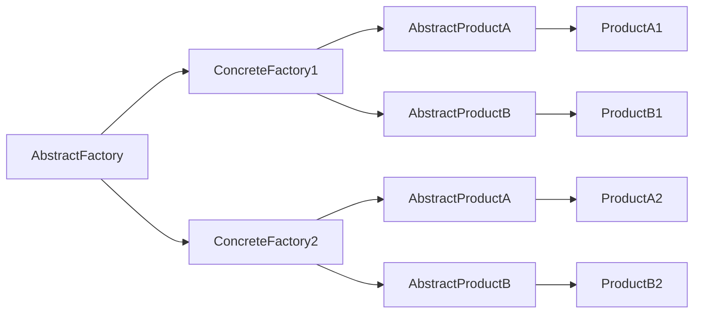

```mermaid 

graph LR
A[AbstractFactory] --> B[ConcreteFactory1]
A[AbstractFactory] --> C[ConcreteFactory2]
B --> D[AbstractProductA]
B --> E[AbstractProductB]
C --> F[AbstractProductA]
C --> G[AbstractProductB]
D --> H[ProductA1]
E --> I[ProductB1]
F --> J[ProductA2]
G --> K[ProductB2]


```