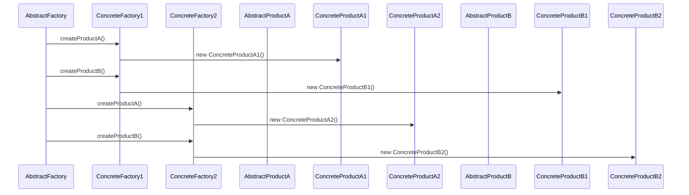

```mermaid 

sequenceDiagram
    participant AbstractFactory
    participant ConcreteFactory1
    participant ConcreteFactory2
    participant AbstractProductA
    participant ConcreteProductA1
    participant ConcreteProductA2
    participant AbstractProductB
    participant ConcreteProductB1
    participant ConcreteProductB2
    
    AbstractFactory->>ConcreteFactory1: createProductA()
    ConcreteFactory1->>ConcreteProductA1: new ConcreteProductA1()
    
    AbstractFactory->>ConcreteFactory1: createProductB()
    ConcreteFactory1->>ConcreteProductB1: new ConcreteProductB1()
    
    AbstractFactory->>ConcreteFactory2: createProductA()
    ConcreteFactory2->>ConcreteProductA2: new ConcreteProductA2()
    
    AbstractFactory->>ConcreteFactory2: createProductB()
    ConcreteFactory2->>ConcreteProductB2: new ConcreteProductB2()

```