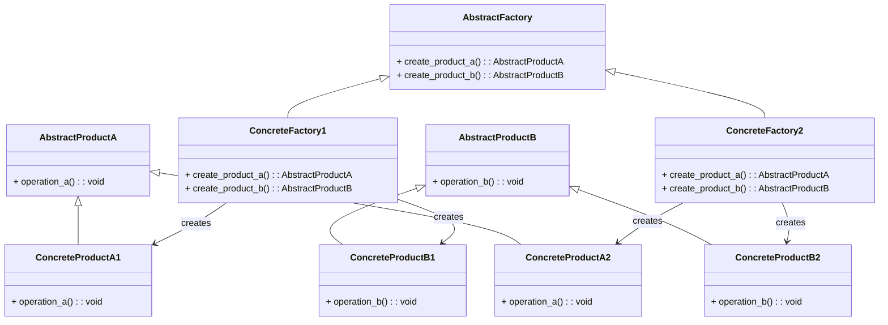

```mermaid
classDiagram
    class AbstractFactory {
        + create_product_a(): AbstractProductA
        + create_product_b(): AbstractProductB
    }

    class AbstractProductA {
        + operation_a(): void
    }

    class AbstractProductB {
        + operation_b(): void
    }

    class ConcreteFactory1 {
        + create_product_a(): AbstractProductA
        + create_product_b(): AbstractProductB
    }

    class ConcreteFactory2 {
        + create_product_a(): AbstractProductA
        + create_product_b(): AbstractProductB
    }

    class ConcreteProductA1 {
        + operation_a(): void
    }

    class ConcreteProductA2 {
        + operation_a(): void
    }

    class ConcreteProductB1 {
        + operation_b(): void
    }

    class ConcreteProductB2 {
        + operation_b(): void
    }

    AbstractFactory <|-- ConcreteFactory1
    AbstractFactory <|-- ConcreteFactory2
    AbstractProductA <|-- ConcreteProductA1
    AbstractProductA <|-- ConcreteProductA2
    AbstractProductB <|-- ConcreteProductB1
    AbstractProductB <|-- ConcreteProductB2
    ConcreteFactory1 --> ConcreteProductA1: creates
    ConcreteFactory1 --> ConcreteProductB1: creates
    ConcreteFactory2 --> ConcreteProductA2: creates
    ConcreteFactory2 --> ConcreteProductB2: creates


```