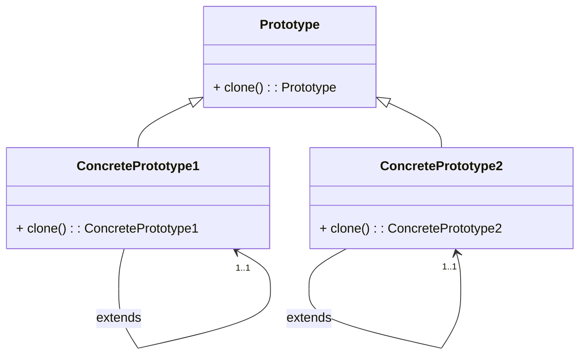

```mermaid
classDiagram
    class Prototype {
        + clone(): Prototype
    }

    class ConcretePrototype1 {
        + clone(): ConcretePrototype1
    }

    class ConcretePrototype2 {
        + clone(): ConcretePrototype2
    }

    Prototype <|-- ConcretePrototype1
    Prototype <|-- ConcretePrototype2

    ConcretePrototype1 --> "1..1" ConcretePrototype1: extends
    ConcretePrototype2 --> "1..1" ConcretePrototype2: extends

```
