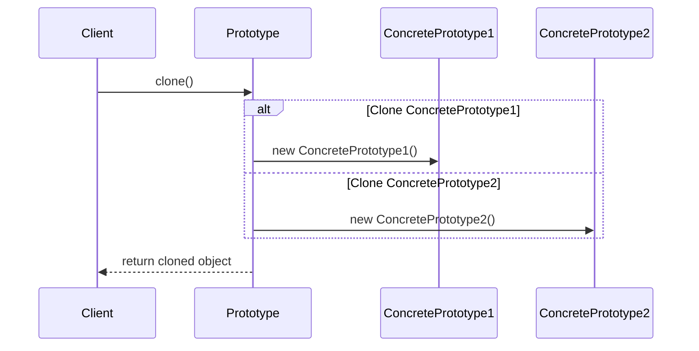

```mermaid
sequenceDiagram
    participant Client
    participant Prototype
    participant ConcretePrototype1
    participant ConcretePrototype2
    
    Client->>Prototype: clone()
    alt Clone ConcretePrototype1
        Prototype->>ConcretePrototype1: new ConcretePrototype1()
    else Clone ConcretePrototype2
        Prototype->>ConcretePrototype2: new ConcretePrototype2()
    end
    Prototype-->>Client: return cloned object


```