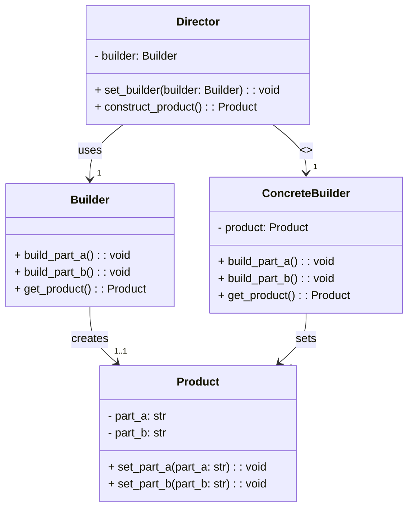

```mermaid 

classDiagram
    class Director {
        - builder: Builder
        + set_builder(builder: Builder): void
        + construct_product(): Product
    }

    class Builder {
        + build_part_a(): void
        + build_part_b(): void
        + get_product(): Product
    }

    class ConcreteBuilder {
        - product: Product
        + build_part_a(): void
        + build_part_b(): void
        + get_product(): Product
    }

    class Product {
        - part_a: str
        - part_b: str
        + set_part_a(part_a: str): void
        + set_part_b(part_b: str): void
    }

    Director --> "1" Builder: uses
    Director --> "1" ConcreteBuilder: <<create>>
    Builder --> "1..1" Product: creates
    ConcreteBuilder --> "1" Product: sets

```