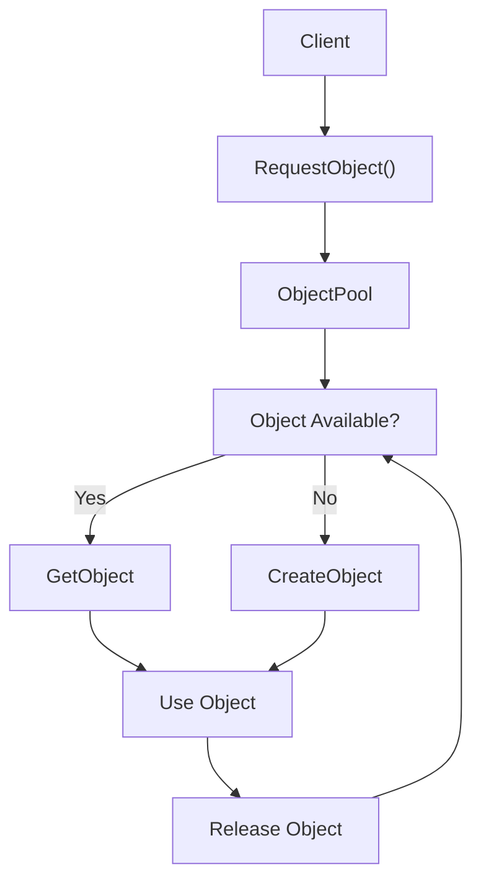

```mermaid
graph TB
A["Client"] --> B["RequestObject()"]
B --> C[ObjectPool]
C --> D[Object Available?]
D -->|Yes| E[GetObject]
D -->|No| F[CreateObject]
E --> G[Use Object]
G --> H[Release Object]
H --> D
F --> G

```