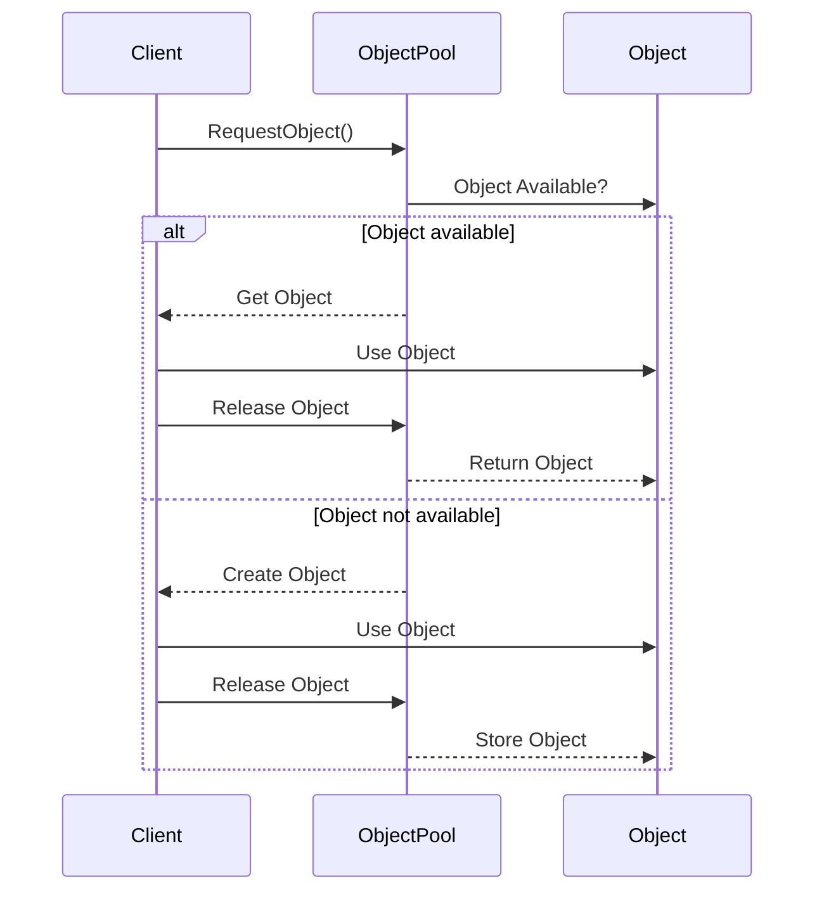

```mermaid

sequenceDiagram
    participant Client
    participant ObjectPool
    participant Object

    Client->>ObjectPool: RequestObject()
    ObjectPool->>Object: Object Available?
    alt Object available
        ObjectPool-->>Client: Get Object
        Client->>Object: Use Object
        Client->>ObjectPool: Release Object
        ObjectPool-->>Object: Return Object
    else Object not available
        ObjectPool-->>Client: Create Object
        Client->>Object: Use Object
        Client->>ObjectPool: Release Object
        ObjectPool-->>Object: Store Object
    end


```