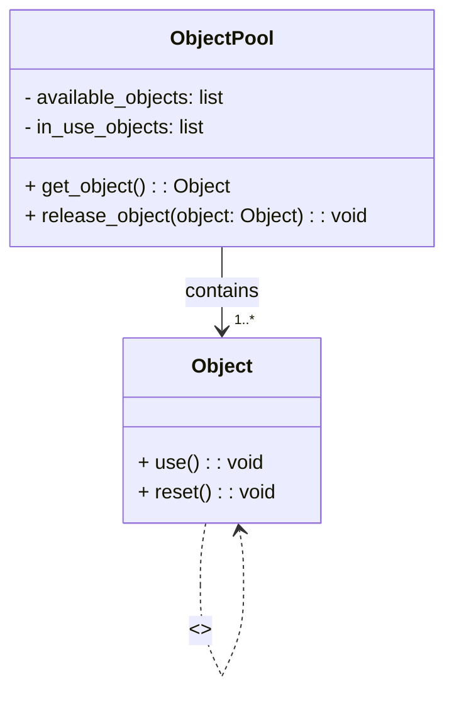

```mermaid 

classDiagram
    class ObjectPool {
        - available_objects: list
        - in_use_objects: list
        + get_object(): Object
        + release_object(object: Object): void
    }

    class Object {
        + use(): void
        + reset(): void
    }

    ObjectPool --> "1..*" Object: contains

    Object ..> Object: <<interface>>

```