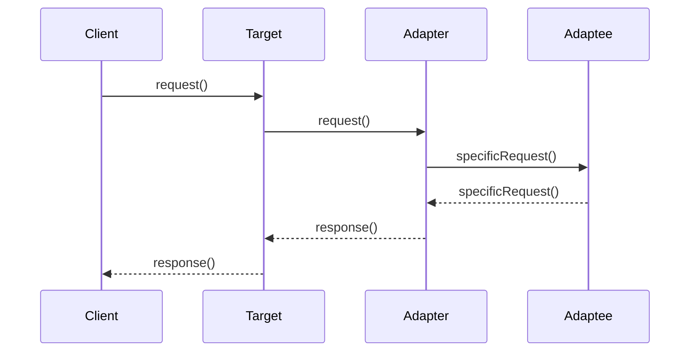

```mermaid 
sequenceDiagram
    participant Client
    participant Target
    participant Adapter
    participant Adaptee
    
    Client->>Target: request()
    Target->>Adapter: request()
    Adapter->>Adaptee: specificRequest()
    Adaptee-->>Adapter: specificRequest()
    Adapter-->>Target: response()
    Target-->>Client: response()

```