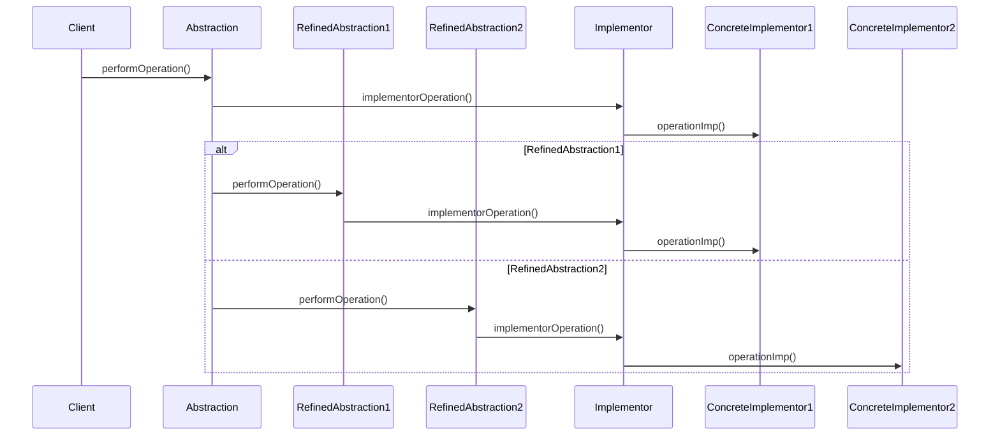

```mermaid
sequenceDiagram
    participant Client
    participant Abstraction
    participant RefinedAbstraction1
    participant RefinedAbstraction2
    participant Implementor
    participant ConcreteImplementor1
    participant ConcreteImplementor2
    
    Client->>Abstraction: performOperation()
    Abstraction->>Implementor: implementorOperation()
    Implementor->>ConcreteImplementor1: operationImp()
    
    alt RefinedAbstraction1
        Abstraction->>RefinedAbstraction1: performOperation()
        RefinedAbstraction1->>Implementor: implementorOperation()
        Implementor->>ConcreteImplementor1: operationImp()
    else RefinedAbstraction2
        Abstraction->>RefinedAbstraction2: performOperation()
        RefinedAbstraction2->>Implementor: implementorOperation()
        Implementor->>ConcreteImplementor2: operationImp()
    end


```