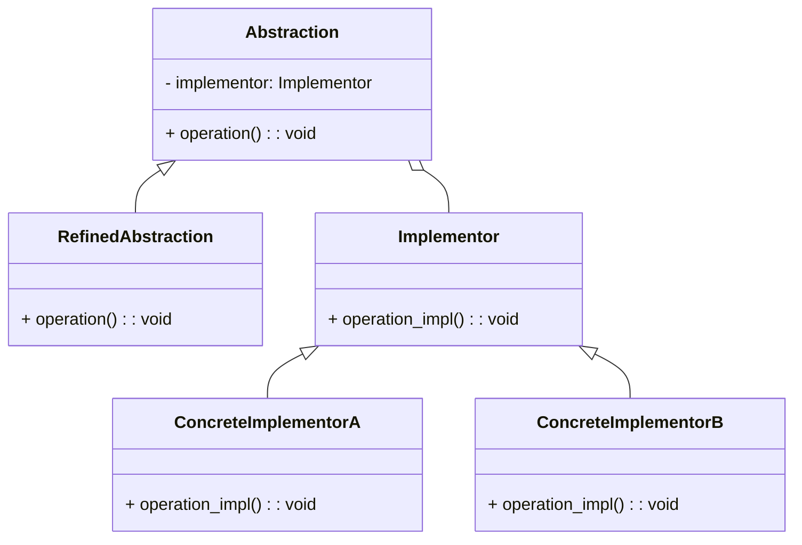

```mermaid 

classDiagram
    class Abstraction {
        - implementor: Implementor
        + operation(): void
    }

    class RefinedAbstraction {
        + operation(): void
    }

    class Implementor {
        + operation_impl(): void
    }

    class ConcreteImplementorA {
        + operation_impl(): void
    }

    class ConcreteImplementorB {
        + operation_impl(): void
    }

    Abstraction <|-- RefinedAbstraction
    Abstraction o-- Implementor
    Implementor <|-- ConcreteImplementorA
    Implementor <|-- ConcreteImplementorB

```