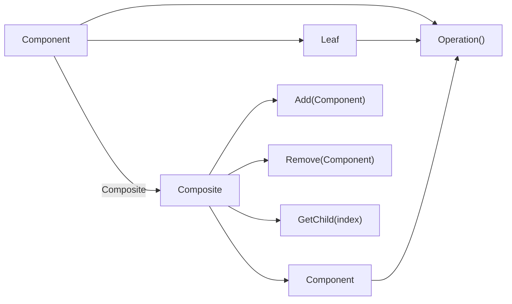

```mermaid

graph LR
A[Component] -->|Composite| B[Composite]
A --> C[Leaf]
B --> D[Component]
B --> E["Add(Component)"]
B --> F["Remove(Component)"]
B --> G["GetChild(index)"]
A --> H["Operation()"]
C --> H
D --> H

```