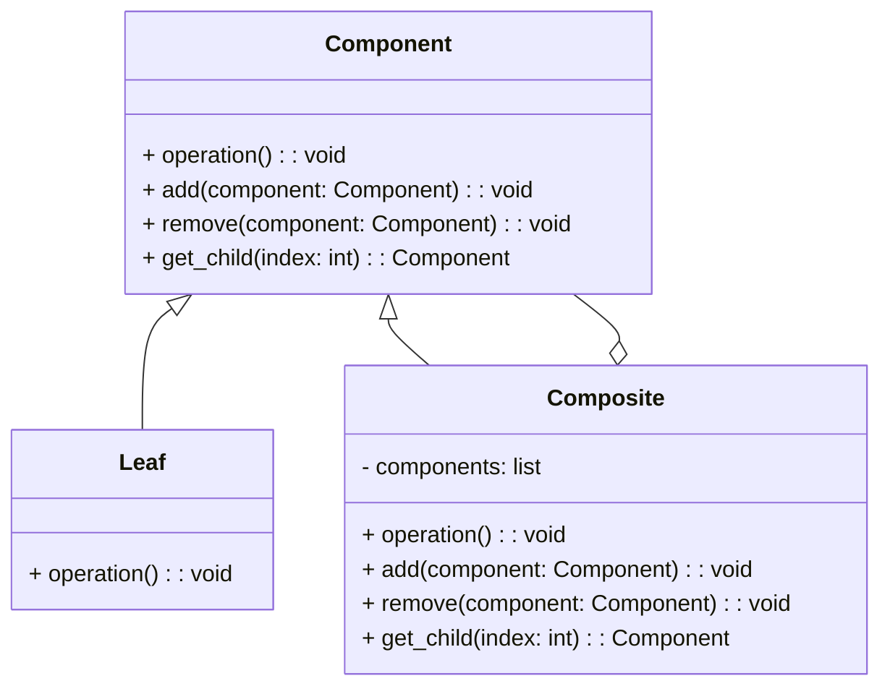

```mermaid 

classDiagram
    class Component {
        + operation(): void
        + add(component: Component): void
        + remove(component: Component): void
        + get_child(index: int): Component
    }

    class Leaf {
        + operation(): void
    }

    class Composite {
        - components: list
        + operation(): void
        + add(component: Component): void
        + remove(component: Component): void
        + get_child(index: int): Component
    }

    Component <|-- Leaf
    Component <|-- Composite
    Composite o-- Component

```