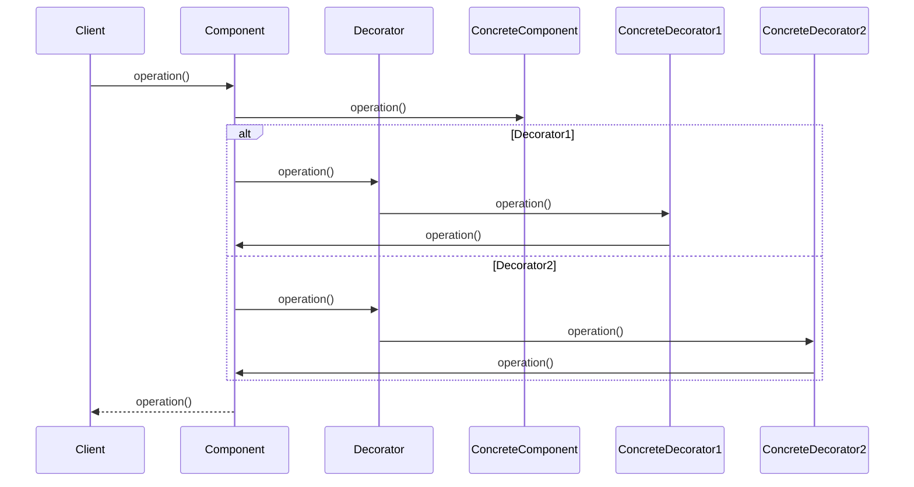

```mermaid 
sequenceDiagram
    participant Client
    participant Component
    participant Decorator
    participant ConcreteComponent
    participant ConcreteDecorator1
    participant ConcreteDecorator2
    
    Client->>Component: operation()
    Component->>ConcreteComponent: operation()
    
    alt Decorator1
        Component->>Decorator: operation()
        Decorator->>ConcreteDecorator1: operation()
        ConcreteDecorator1->>Component: operation()
    else Decorator2
        Component->>Decorator: operation()
        Decorator->>ConcreteDecorator2: operation()
        ConcreteDecorator2->>Component: operation()
    end
    Component-->>Client: operation()


```