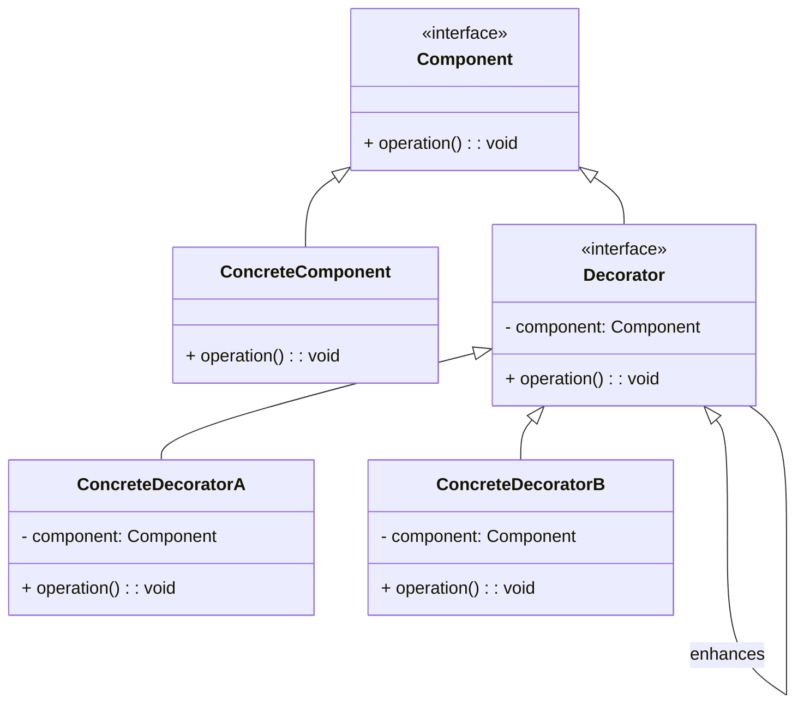

```mermaid 
classDiagram
    class Component {
        + operation(): void
    }
    <<interface>> Component

    class ConcreteComponent {
        + operation(): void
    }

    class Decorator {
        - component: Component
        + operation(): void
    }
    <<interface>> Decorator

    class ConcreteDecoratorA {
        - component: Component
        + operation(): void
    }

    class ConcreteDecoratorB {
        - component: Component
        + operation(): void
    }

    Component <|-- ConcreteComponent
    Component <|-- Decorator
    Decorator <|-- ConcreteDecoratorA
    Decorator <|-- ConcreteDecoratorB  
    Decorator <|-- Decorator: enhances


```