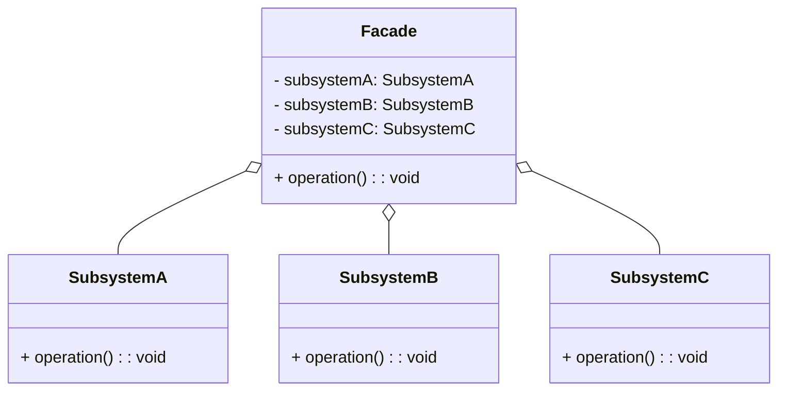

```mermaid 

classDiagram
    class SubsystemA {
        + operation(): void
    }

    class SubsystemB {
        + operation(): void
    }

    class SubsystemC {
        + operation(): void
    }

    class Facade {
        - subsystemA: SubsystemA
        - subsystemB: SubsystemB
        - subsystemC: SubsystemC
        + operation(): void
    }

    Facade o-- SubsystemA
    Facade o-- SubsystemB
    Facade o-- SubsystemC


```