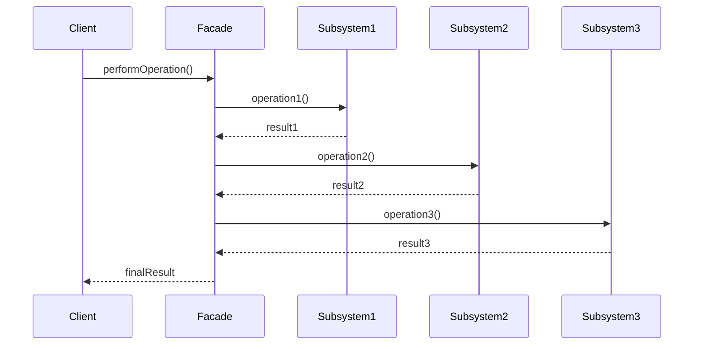

```mermaid 

sequenceDiagram
    participant Client
    participant Facade
    participant Subsystem1
    participant Subsystem2
    participant Subsystem3
    
    Client->>Facade: performOperation()
    Facade->>Subsystem1: operation1()
    Subsystem1-->>Facade: result1
    Facade->>Subsystem2: operation2()
    Subsystem2-->>Facade: result2
    Facade->>Subsystem3: operation3()
    Subsystem3-->>Facade: result3
    Facade-->>Client: finalResult


```