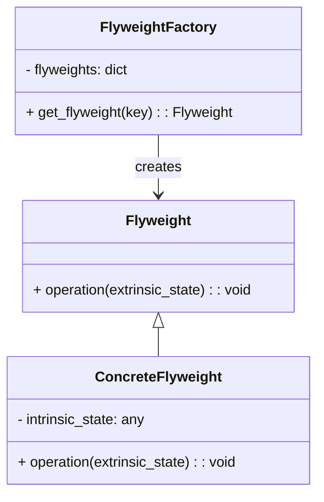

```mermaid 

classDiagram
    class Flyweight {
        + operation(extrinsic_state): void
    }

    class ConcreteFlyweight {
        - intrinsic_state: any
        + operation(extrinsic_state): void
    }

    class FlyweightFactory {
        - flyweights: dict
        + get_flyweight(key): Flyweight
    }

    Flyweight <|-- ConcreteFlyweight
    FlyweightFactory --> Flyweight: creates

```