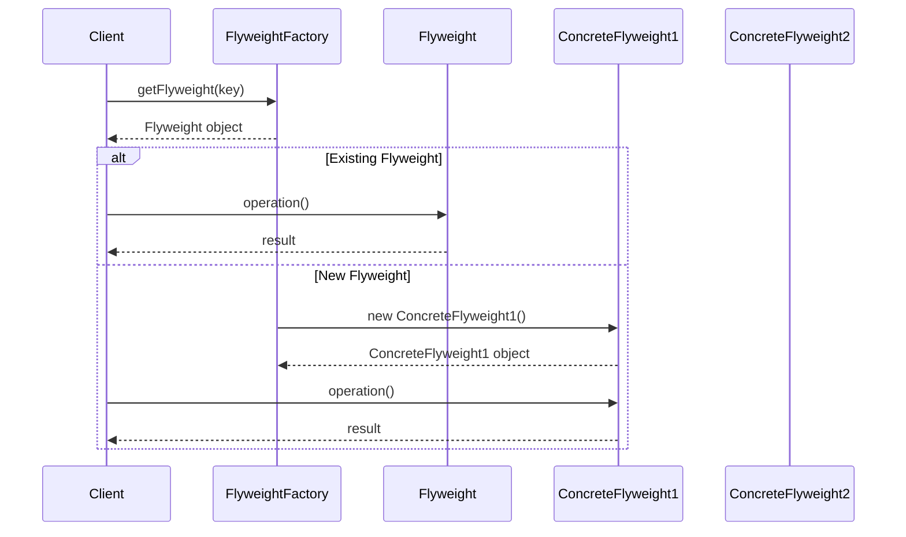

```mermaid

sequenceDiagram
    participant Client
    participant FlyweightFactory
    participant Flyweight
    participant ConcreteFlyweight1
    participant ConcreteFlyweight2
    
    Client->>FlyweightFactory: getFlyweight(key)
    FlyweightFactory-->>Client: Flyweight object
    
    alt Existing Flyweight
        Client->>Flyweight: operation()
        Flyweight-->>Client: result
    else New Flyweight
        FlyweightFactory->>ConcreteFlyweight1: new ConcreteFlyweight1()
        ConcreteFlyweight1-->>FlyweightFactory: ConcreteFlyweight1 object
        Client->>ConcreteFlyweight1: operation()
        ConcreteFlyweight1-->>Client: result
    end


```