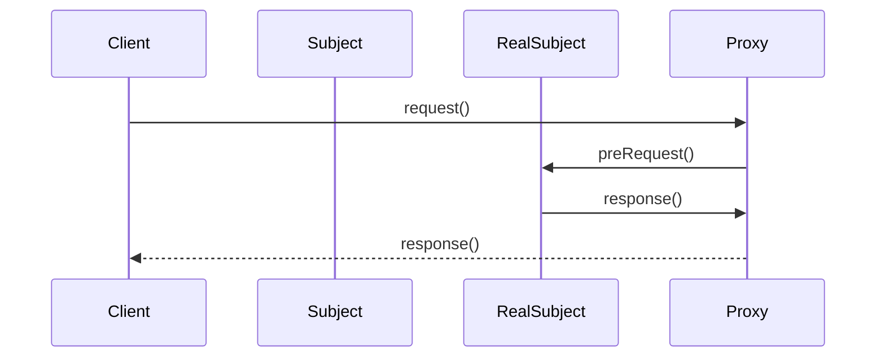

```mermaid
sequenceDiagram
    participant Client
    participant Subject
    participant RealSubject
    participant Proxy
    
    Client->>Proxy: request()
    Proxy->>RealSubject: preRequest()
    RealSubject->>Proxy: response()
    Proxy-->>Client: response()


```