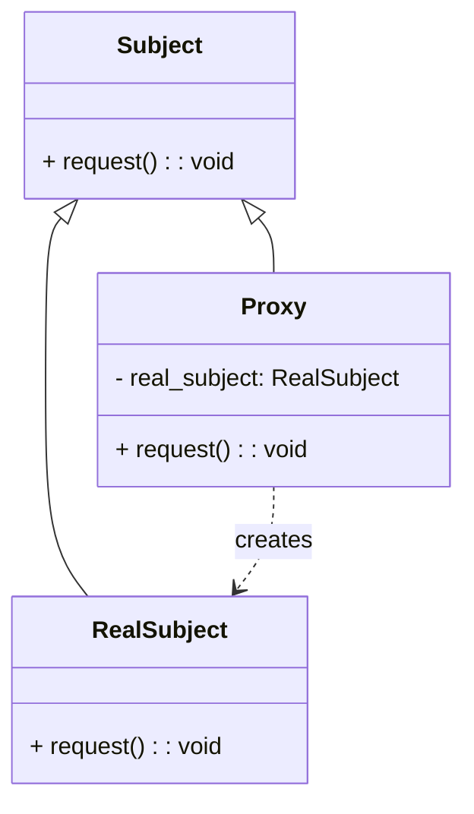

```mermaid
classDiagram
    class Subject {
        + request(): void
    }

    class RealSubject {
        + request(): void
    }

    class Proxy {
        - real_subject: RealSubject
        + request(): void
    }

    Subject <|-- Proxy
    Subject <|-- RealSubject
    Proxy ..> RealSubject: creates

```