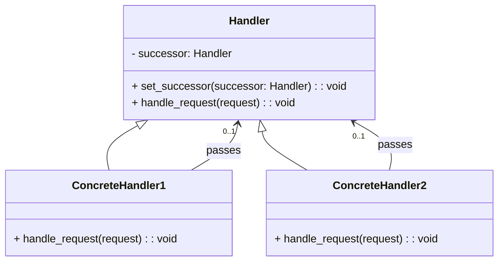

```mermaid
classDiagram
    class Handler {
        - successor: Handler
        + set_successor(successor: Handler): void
        + handle_request(request): void
    }

    class ConcreteHandler1 {
        + handle_request(request): void
    }

    class ConcreteHandler2 {
        + handle_request(request): void
    }

    Handler <|-- ConcreteHandler1
    Handler <|-- ConcreteHandler2
    ConcreteHandler1 --> "0..1" Handler: passes
    ConcreteHandler2 --> "0..1" Handler: passes

```