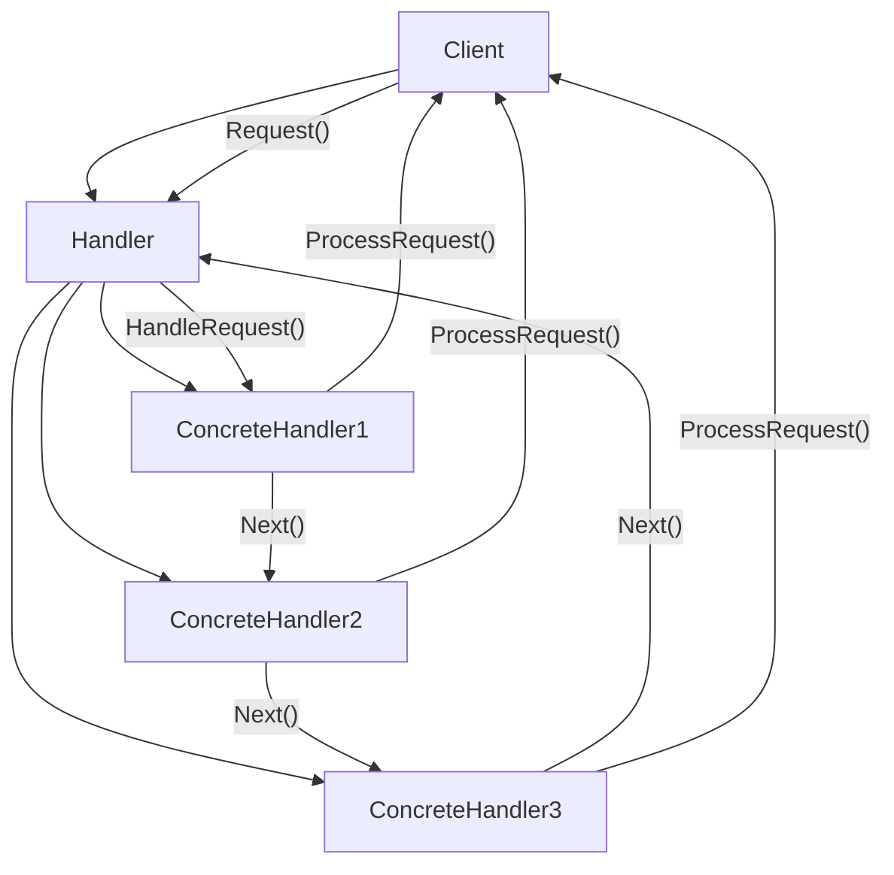

```mermaid

graph TB
A[Client] --> B[Handler]
B --> C[ConcreteHandler1]
B --> D[ConcreteHandler2]
B --> E[ConcreteHandler3]
A -->|"Request()"| B
B -->|"HandleRequest()"| C
C -->|"Next()"| D
D -->|"Next()"| E
E -->|"Next()"| B
C -->|"ProcessRequest()"| A
D -->|"ProcessRequest()"| A
E -->|"ProcessRequest()"| A

```