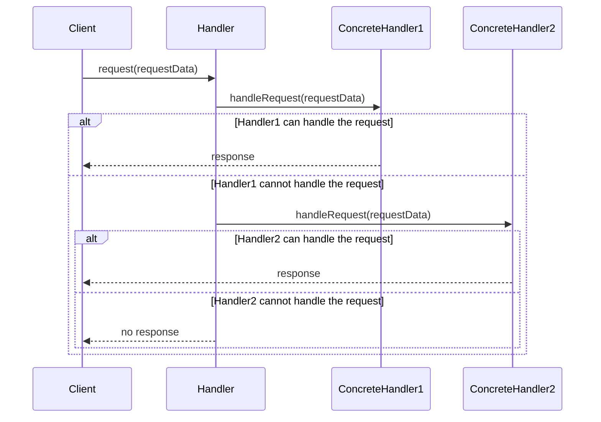

```mermaid 
sequenceDiagram
    participant Client
    participant Handler
    participant ConcreteHandler1
    participant ConcreteHandler2
    
    Client->>Handler: request(requestData)
    Handler->>ConcreteHandler1: handleRequest(requestData)
    alt Handler1 can handle the request
        ConcreteHandler1-->>Client: response
    else Handler1 cannot handle the request
        Handler->>ConcreteHandler2: handleRequest(requestData)
        alt Handler2 can handle the request
            ConcreteHandler2-->>Client: response
        else Handler2 cannot handle the request
            Handler-->>Client: no response
        end
    end


```