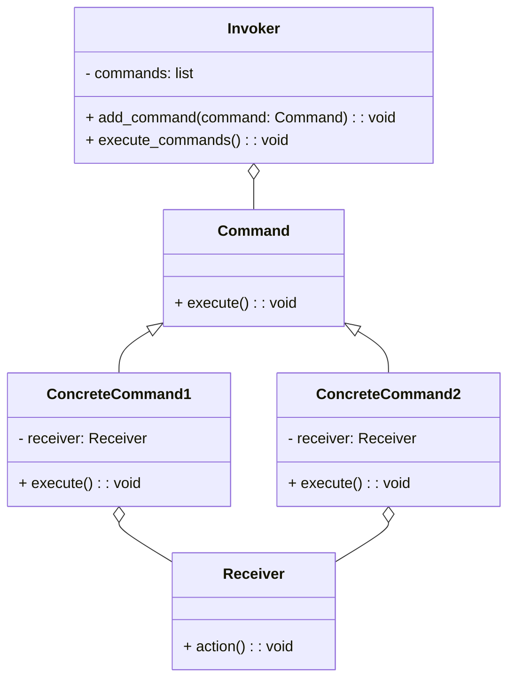

```mermaid
classDiagram
    class Command {
        + execute(): void
    }

    class Receiver {
        + action(): void
    }

    class ConcreteCommand1 {
        - receiver: Receiver
        + execute(): void
    }

    class ConcreteCommand2 {
        - receiver: Receiver
        + execute(): void
    }

    class Invoker {
        - commands: list
        + add_command(command: Command): void
        + execute_commands(): void
    }

    Command <|-- ConcreteCommand1
    Command <|-- ConcreteCommand2
    ConcreteCommand1 o-- Receiver
    ConcreteCommand2 o-- Receiver
    Invoker o-- Command

```