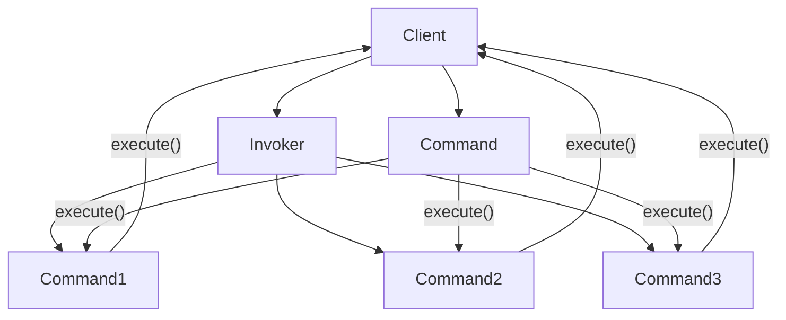

```mermaid

graph TB
A[Client] --> B[Invoker]
A --> C[Command]
B --> D[Command1]
B --> E[Command2]
B --> F[Command3]
C -->|"execute()"| D
C -->|"execute()"| E
C -->|"execute()"| F
D -->|"execute()"| A
E -->|"execute()"| A
F -->|"execute()"| A

```