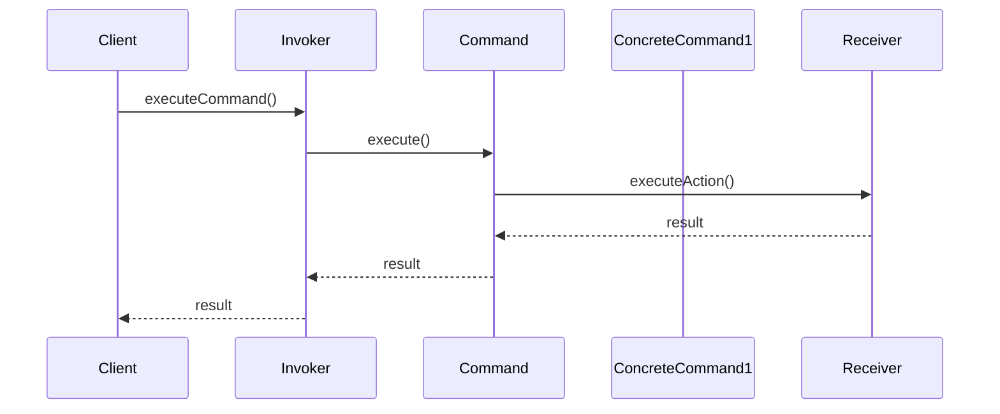

```mermaid
sequenceDiagram
    participant Client
    participant Invoker
    participant Command
    participant ConcreteCommand1
    participant Receiver
    
    Client->>Invoker: executeCommand()
    Invoker->>Command: execute()
    Command->>Receiver: executeAction()
    Receiver-->>Command: result
    Command-->>Invoker: result
    Invoker-->>Client: result


```