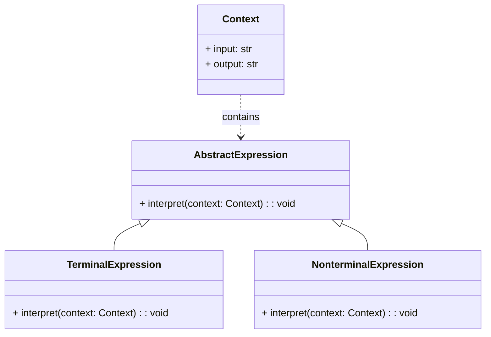

```mermaid 
classDiagram
    class Context {
        + input: str
        + output: str
    }

    class AbstractExpression {
        + interpret(context: Context): void
    }

    class TerminalExpression {
        + interpret(context: Context): void
    }

    class NonterminalExpression {
        + interpret(context: Context): void
    }

    Context ..> AbstractExpression: contains
    AbstractExpression <|-- TerminalExpression
    AbstractExpression <|-- NonterminalExpression

```