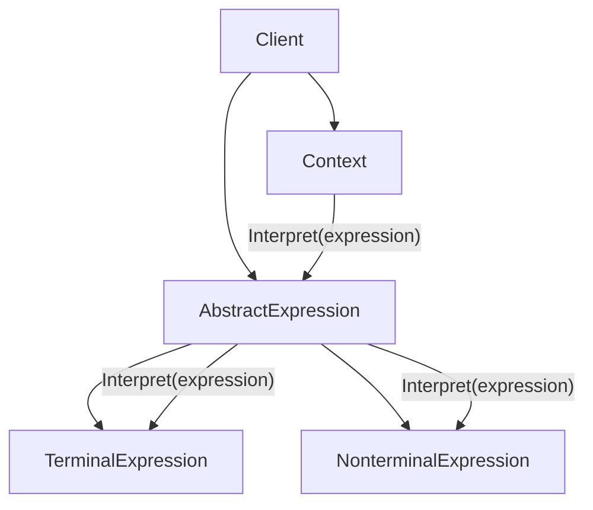

```mermaid

graph TB
A[Client] --> B[Context]
A --> C[AbstractExpression]
C --> D[TerminalExpression]
C --> E[NonterminalExpression]
B -->|"Interpret(expression)"| C
C -->|"Interpret(expression)"| D
C -->|"Interpret(expression)"| E
```