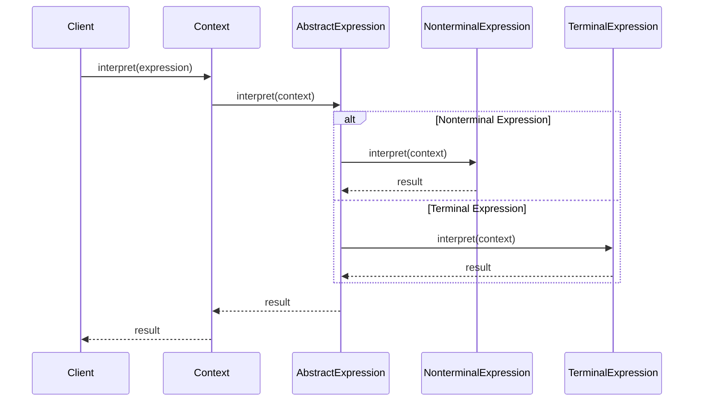

```mermaid

sequenceDiagram
    participant Client
    participant Context
    participant AbstractExpression
    participant NonterminalExpression
    participant TerminalExpression
    
    Client->>Context: interpret(expression)
    Context->>AbstractExpression: interpret(context)
    
    alt Nonterminal Expression
        AbstractExpression->>NonterminalExpression: interpret(context)
        NonterminalExpression-->>AbstractExpression: result
    else Terminal Expression
        AbstractExpression->>TerminalExpression: interpret(context)
        TerminalExpression-->>AbstractExpression: result
    end
    AbstractExpression-->>Context: result
    Context-->>Client: result


```