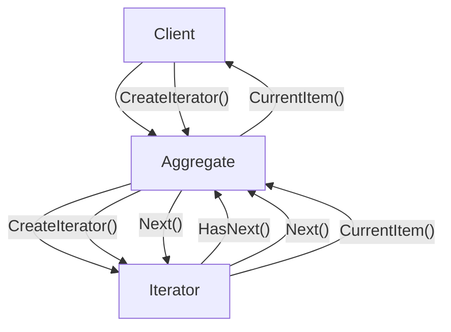

```mermaid
graph TD
A[Client] --> B[Aggregate]
B --> C[Iterator]
A -->|"CreateIterator()"| B
B -->|"CreateIterator()"| C
C -->|"HasNext()"| B
B -->|"Next()"| C
C -->|"Next()"| B
C -->|"CurrentItem()"| B
B -->|"CurrentItem()"| A

```