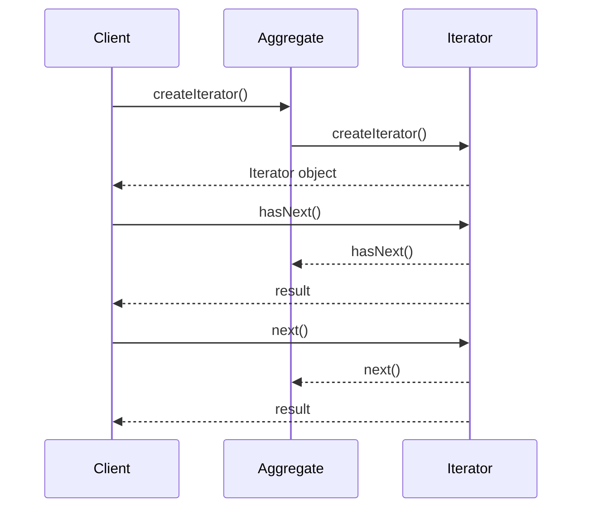

```mermaid

sequenceDiagram
    participant Client
    participant Aggregate
    participant Iterator
    
    Client->>Aggregate: createIterator()
    Aggregate->>Iterator: createIterator()
    Iterator-->>Client: Iterator object
    
    Client->>Iterator: hasNext()
    Iterator-->>Aggregate: hasNext()
    Iterator-->>Client: result
    
    Client->>Iterator: next()
    Iterator-->>Aggregate: next()
    Iterator-->>Client: result

```