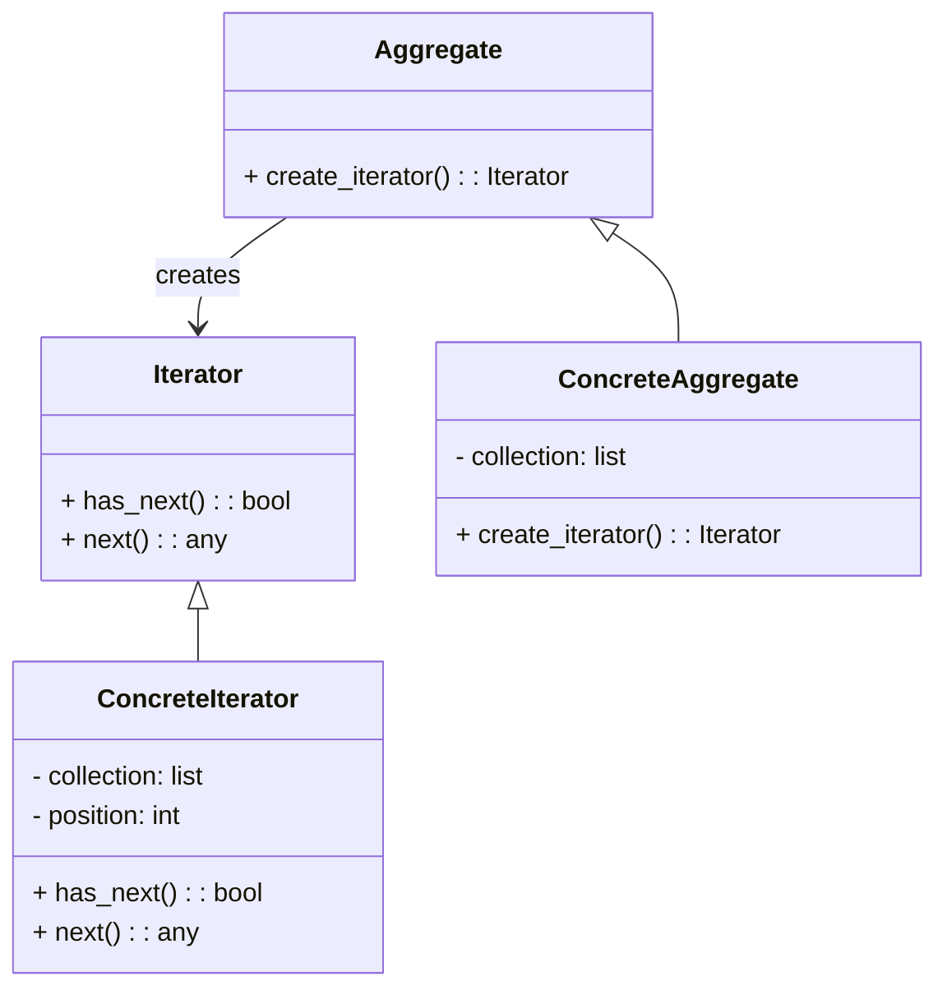

```mermaid
classDiagram
    class Iterator {
        + has_next(): bool
        + next(): any
    }

    class Aggregate {
        + create_iterator(): Iterator
    }

    class ConcreteIterator {
        - collection: list
        - position: int
        + has_next(): bool
        + next(): any
    }

    class ConcreteAggregate {
        - collection: list
        + create_iterator(): Iterator
    }

    Aggregate <|-- ConcreteAggregate
    Iterator <|-- ConcreteIterator
    Aggregate --> Iterator: creates


```