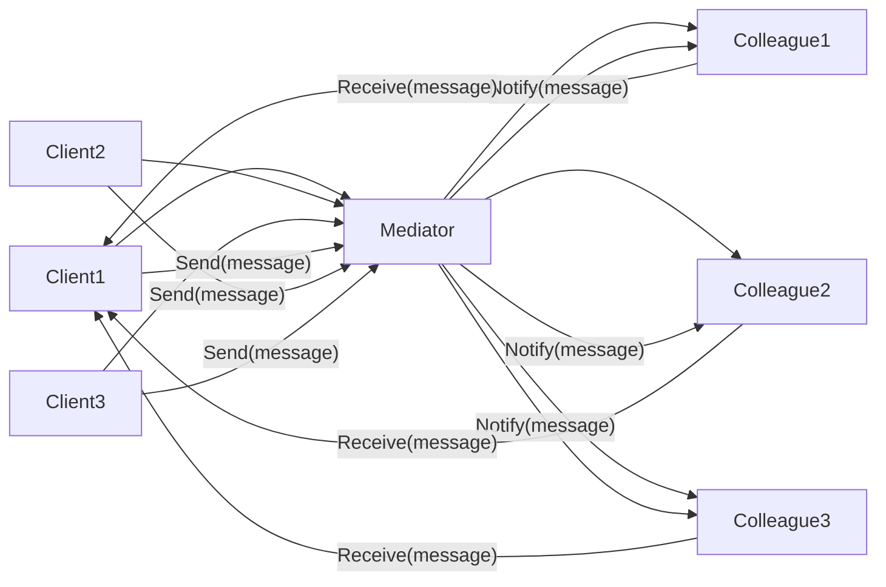

```mermaid
graph LR
A[Client1] --> B[Mediator]
C[Client2] --> B
D[Client3] --> B
B --> E[Colleague1]
B --> F[Colleague2]
B --> G[Colleague3]
A -->|"Send(message)"| B
C -->|"Send(message)"| B
D -->|"Send(message)"| B
B -->|"Notify(message)"| E
B -->|"Notify(message)"| F
B -->|"Notify(message)"| G
E -->|"Receive(message)"| A
F -->|"Receive(message)"| A
G -->|"Receive(message)"| A


```