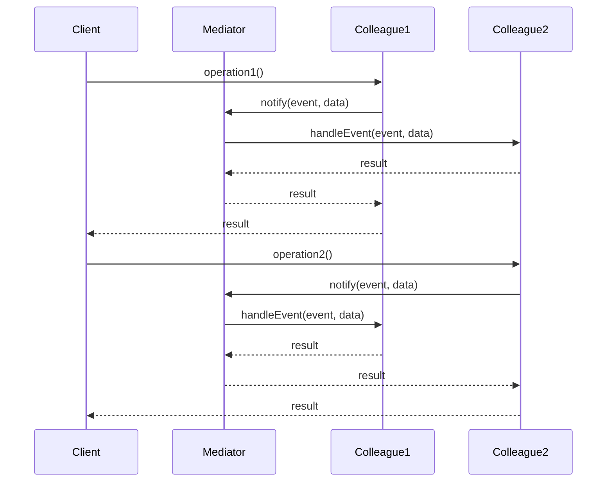

```mermaid
sequenceDiagram
    participant Client
    participant Mediator
    participant Colleague1
    participant Colleague2
    
    Client->>Colleague1: operation1()
    Colleague1->>Mediator: notify(event, data)
    Mediator->>Colleague2: handleEvent(event, data)
    Colleague2-->>Mediator: result
    Mediator-->>Colleague1: result
    Colleague1-->>Client: result
    
    Client->>Colleague2: operation2()
    Colleague2->>Mediator: notify(event, data)
    Mediator->>Colleague1: handleEvent(event, data)
    Colleague1-->>Mediator: result
    Mediator-->>Colleague2: result
    Colleague2-->>Client: result


```