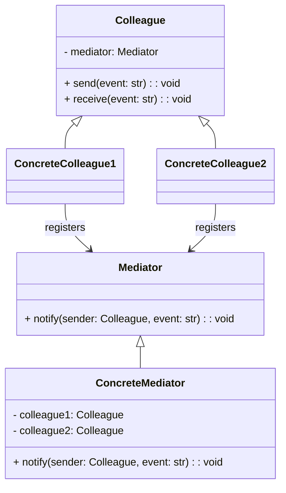

```mermaid
classDiagram
    class Mediator {
        + notify(sender: Colleague, event: str): void
    }

    class Colleague {
        - mediator: Mediator
        + send(event: str): void
        + receive(event: str): void
    }

    class ConcreteMediator {
        - colleague1: Colleague
        - colleague2: Colleague
        + notify(sender: Colleague, event: str): void
    }

    Mediator <|-- ConcreteMediator
    Colleague <|-- ConcreteColleague1
    Colleague <|-- ConcreteColleague2
    ConcreteColleague1 --> Mediator: registers
    ConcreteColleague2 --> Mediator: registers


```