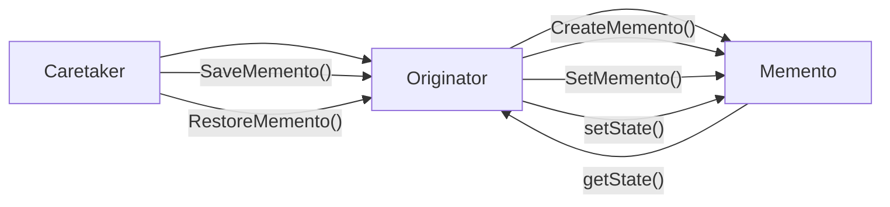

```mermaid
graph LR
A[Originator] --> B[Memento]
C[Caretaker] --> A
A -->|"CreateMemento()"| B
A -->|"SetMemento()"| B
C -->|"SaveMemento()"| A
C -->|"RestoreMemento()"| A
B -->|"getState()"| A
A -->|"setState()"| B

```