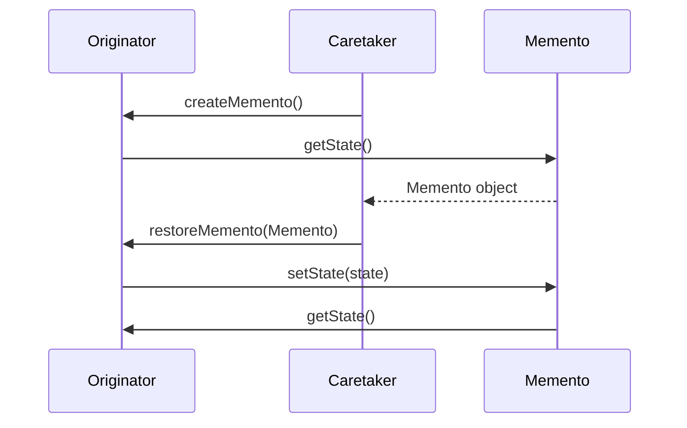

```mermaid

sequenceDiagram
    participant Originator
    participant Caretaker
    participant Memento
    
    Caretaker->>Originator: createMemento()
    Originator->>Memento: getState()
    Memento-->>Caretaker: Memento object
    
    Caretaker->>Originator: restoreMemento(Memento)
    Originator->>Memento: setState(state)
    Memento->>Originator: getState()

```