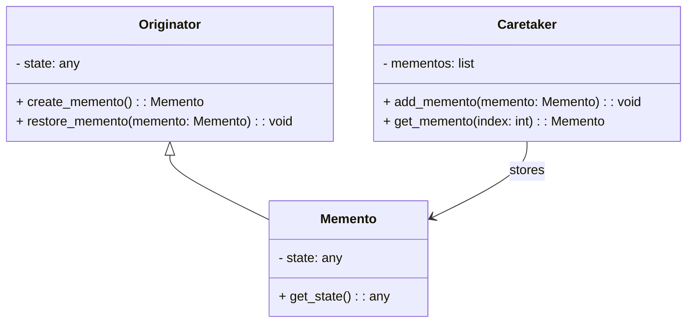

```mermaid 
classDiagram
    class Originator {
        - state: any
        + create_memento(): Memento
        + restore_memento(memento: Memento): void
    }

    class Memento {
        - state: any
        + get_state(): any
    }

    class Caretaker {
        - mementos: list
        + add_memento(memento: Memento): void
        + get_memento(index: int): Memento
    }

    Originator <|-- Memento
    Caretaker --> Memento: stores


```