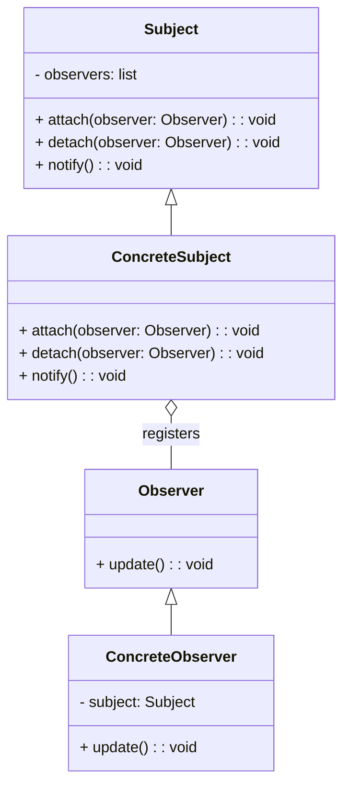

```mermaid 

classDiagram
    class Subject {
        - observers: list
        + attach(observer: Observer): void
        + detach(observer: Observer): void
        + notify(): void
    }

    class Observer {
        + update(): void
    }

    class ConcreteSubject {
        + attach(observer: Observer): void
        + detach(observer: Observer): void
        + notify(): void
    }

    class ConcreteObserver {
        - subject: Subject
        + update(): void
    }

    Subject <|-- ConcreteSubject
    Observer <|-- ConcreteObserver
    ConcreteSubject o-- Observer: registers

```