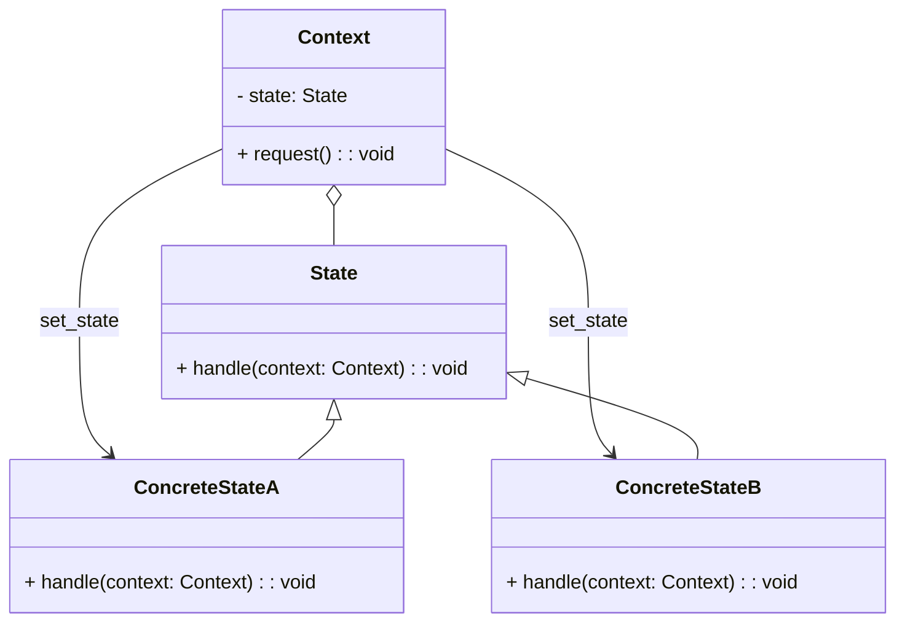

```mermaid 

classDiagram
    class Context {
        - state: State
        + request(): void
    }

    class State {
        + handle(context: Context): void
    }

    class ConcreteStateA {
        + handle(context: Context): void
    }

    class ConcreteStateB {
        + handle(context: Context): void
    }

    Context o-- State
    Context --> ConcreteStateA: set_state
    Context --> ConcreteStateB: set_state
    State <|-- ConcreteStateA
    State <|-- ConcreteStateB

```