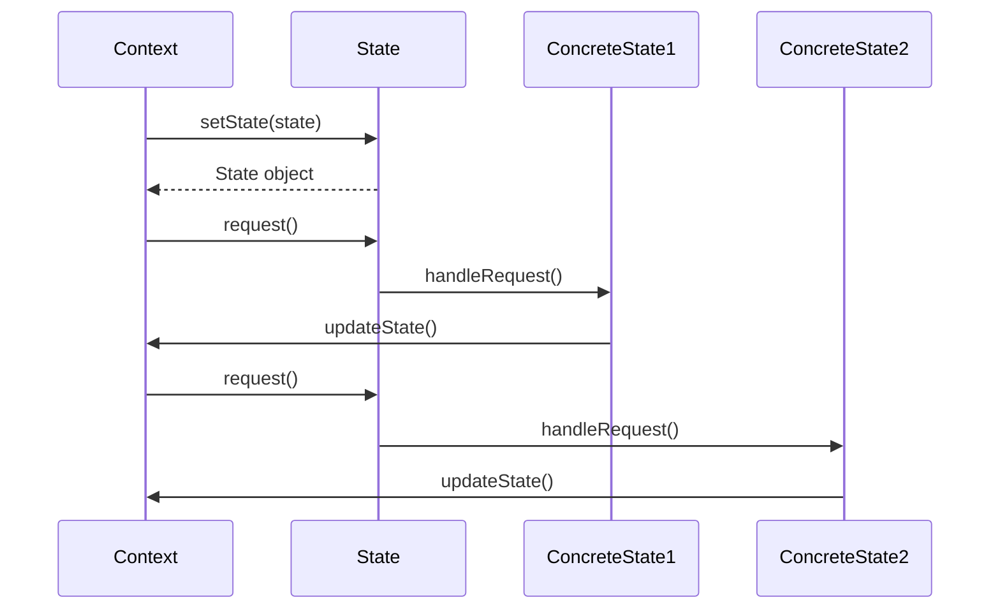

```mermaid

sequenceDiagram
    participant Context
    participant State
    participant ConcreteState1
    participant ConcreteState2
    
    Context->>State: setState(state)
    State-->>Context: State object
    
    Context->>State: request()
    State->>ConcreteState1: handleRequest()
    ConcreteState1->>Context: updateState()
    Context->>State: request()
    State->>ConcreteState2: handleRequest()
    ConcreteState2->>Context: updateState()


```