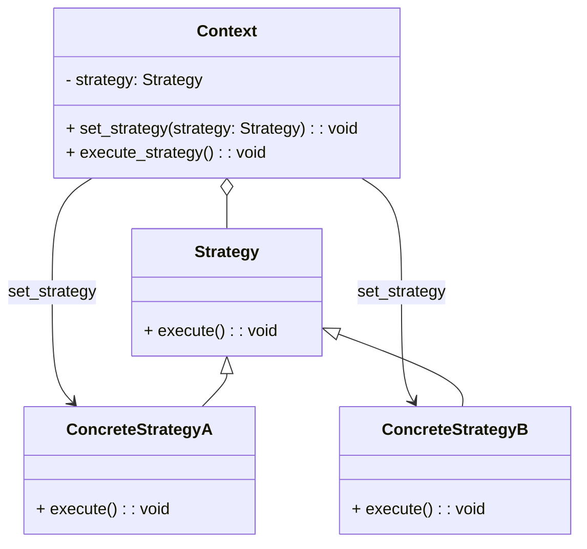

```mermaid 

classDiagram
    class Context {
        - strategy: Strategy
        + set_strategy(strategy: Strategy): void
        + execute_strategy(): void
    }

    class Strategy {
        + execute(): void
    }

    class ConcreteStrategyA {
        + execute(): void
    }

    class ConcreteStrategyB {
        + execute(): void
    }

    Context o-- Strategy
    Context --> ConcreteStrategyA: set_strategy
    Context --> ConcreteStrategyB: set_strategy
    Strategy <|-- ConcreteStrategyA
    Strategy <|-- ConcreteStrategyB

```